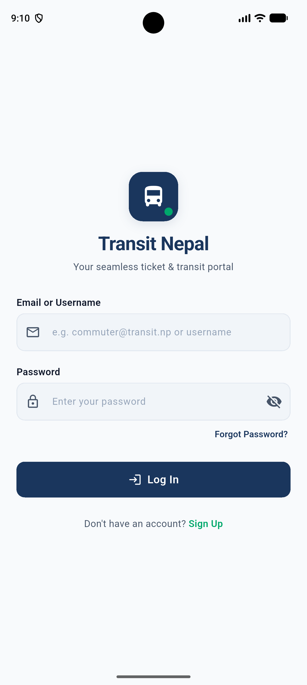
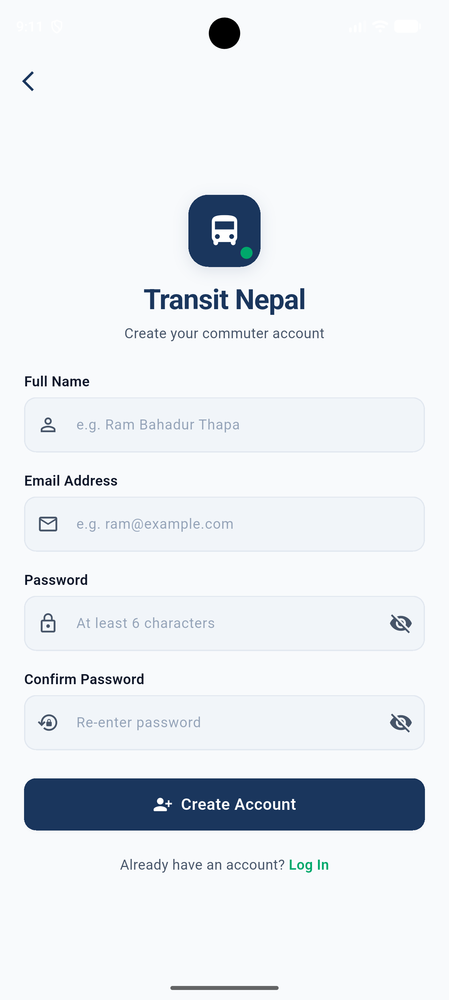

# Transit Nepal - Public Transit Ticketing & Authentication Module

A clean, modern, and production-ready Flutter authentication module (Login & Registration) tailored for **Transit Nepal**, a public transit and bus ticketing portal. Designed with best UI/UX practices, clean directory architecture, robust form validation, null safety, and responsive touch ergonomics.

---

## 📸 Screenshots

| Login Screen | Registration Screen |
| :---: | :---: |
|  |  |

---

## ✨ Key Features

### 🔐 Login Module (`login_screen.dart`)
- **Branding Header:** Custom `AuthHeader` widget displaying a transit bus badge and application title.
- **Email/Username Input:** Includes prefix icon, floating labels, clear hint text, and minimum 3-character validation.
- **Password Input:** Password field with prefix icon and interactive eye toggle for show/hide visibility.
- **Forgot Password Action:** Quick action text button triggering a demo notification `SnackBar`.
- **Primary Submit Button:** Tactile button with loading spinner simulation and form validation.
- **Inline Sign-Up Link:** Smooth navigation transition to the Registration screen.

### 📝 Registration Module (`register_screen.dart`)
- **Full Name Field:** Validated for required input (minimum 2 characters).
- **Email Field:** Strict regex format validation for valid email address strings.
- **Password & Confirm Password Fields:** Independent show/hide visibility toggles and real-time password matching validation.
- **Account Creation Simulation:** Handles async submit flow with loading feedback and redirects to Login upon successful registration.
- **Back to Login Link:** Quick return link for existing users.

---

## 📂 Project Architecture

```
bus_ticket/
├── assets/
│   ├── icons/
│   └── images/
├── lib/
│   ├── main.dart
│   ├── constants/
│   │   ├── app_colors.dart
│   │   └── app_text_styles.dart
│   ├── screens/
│   │   ├── login_screen.dart
│   │   └── register_screen.dart
│   ├── widgets/
│   │   ├── custom_text_field.dart
│   │   ├── primary_button.dart
│   │   └── auth_header.dart
│   └── utils/
│       └── validators.dart
├── pubspec.yaml
└── README.md
```

---

## 🛠️ Tech Stack & Dependencies

- **Framework:** [Flutter](https://flutter.dev) (Dart SDK `^3.13.2`)
- **UI Design System:** Material 3 Design with custom Transit Navy (`#1A365D`) & Emerald Green (`#00A86B`) palette.
- **Icons:** Material Icons & Cupertino Icons.

---

## 🚀 Getting Started

### Prerequisites
- [Flutter SDK](https://docs.flutter.dev/get-started/install) (version >= 3.13.2)
- Android Studio / VS Code with Flutter extension installed
- Android Emulator / iOS Simulator / Physical Device

### Installation & Setup

1. **Clone the Repository:**
   ```bash
   git clone https://github.com/your-username/transit_nepal_auth.git
   cd transit_nepal_auth
   ```

2. **Install Dependencies:**
   ```bash
   flutter pub get
   ```

3. **Run the Application:**
   ```bash
   flutter run
   ```

---

## 🎨 Design System Summary

- **Primary Transit Navy:** `#1A365D`
- **Accent Emerald Green:** `#00A86B`
- **Neutral Background:** `#F8FAFC`
- **Input Border:** `#E2E8F0`
- **Touch Target Height:** Minimum 48–56 dp for optimal mobile accessibility.
